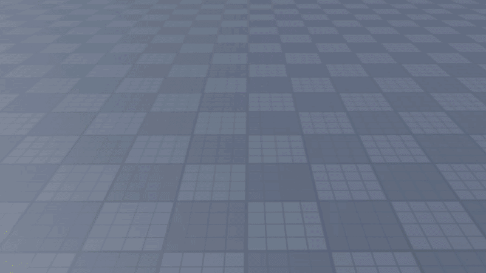
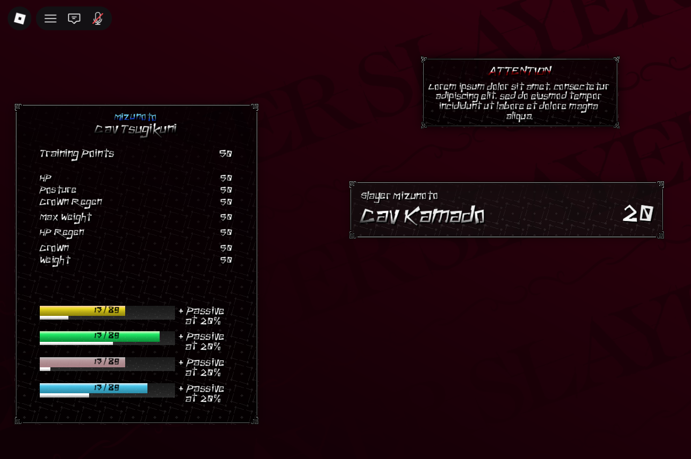
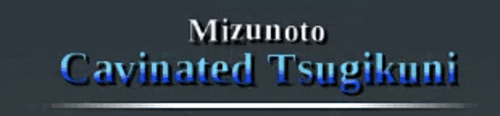

# FancyText

A powerful and flexible text rendering module for Roblox that supports custom fonts, text effects, inline icons, and rich formatting through tags. Perfect for creating dynamic UI text with animations, colors, and special effects.

## Features

- [x] **Custom Fonts** - Import TTF fonts using TTFToRoblox
- [x] **Built-in Fonts** - Support for Roblox Enum.Font and FontFace
- [x] **Text Effects** - 15+ built-in effects (shake, wave, rainbow, typewriter, animated gradients, etc.), all freely stackable on one string
- [x] **Inline Icons** - Embed ImageLabels within text
- [x] **Text Alignment** - Left, Right, and Center alignment
- [x] **UI Scaling** - `Config.Scale` (defaults to `true`) automatically scales rendered text relative to a 1920x1080 reference resolution, similar to Roblox's native `TextScaled` option on a `TextLabel`. Set `Scale = false` if you're already handling scaling yourself.
- [x] **Word Wrapping** - Intelligent word wrapping with custom fonts
- [x] **BBCode Tags** - Toggle effects on/off with `<effect>` tags
- [x] **Extensible** - Easy to create custom effects
- [x] **TextLabel Replacement** - Swap a design-time TextLabel for FancyText at runtime
- [x] **On-Demand Effects** - Trigger transitions like `fall`/`fade` from any event, not just a tag-driven timer
- [ ] Improved performance optimizations

## Demo






```lua
local ft = require(path.to.FancyText)

local text = "<shadow 5 5><wave><typewrite><rainbow>This is FancyText"
local cleanup_trove = ft.MakeText(container, text, {
    FontFace = Font.new("rbxassetid://fonts/families/Inconsolata.json"),
    FontSize = 80,
    VerticalAlign = "Center"
})

-- cleanup when done..
task.delay(10, function()
    cleanup_trove:Clean()
end)
```

## Built-in Effects

**Motion:** `wave`, `floatwave`, `shake`, `jitter`

**Color:** `rainbow`, `col R G B`, `demonic`, `flicker`, `gradient`, `gradientWave`

**Entrances & exits:** `fi`, `typewrite`, `fall`, `fade`, `clickpop`, `smash`

**Other:** `shadow`, `b`

Effects stack freely - `<shadow><wave><typewrite><fade 1 0.5>` applies all four to the same text. `fall`/`fade`/`clickpop`/`smash` also work on demand via [`:PlayEffect(...)`](#triggering-effects-on-demand) (note `smash` doesn't report `delay`/`duration`, so it can't be used with `autoClean = true` - see the caveat in that section). Each effect's exact parameters are in its source file in `Effects/`; see [Creating Custom Effects](#creating-custom-effects) for the format if you want to add your own.

## Icons

If you want to use inline icons with `<icon>` tags:

```lua
local config = {
    FontSize = 30,
    IconsFolder = game.ReplicatedStorage.Assets.Icons, -- Folder containing ImageLabels
}

local trove = FancyText.MakeText(
    container,
    "Collect <icon Coin> coins!",
    config
)
```

Icons render as a `FontSize`-square, flush with the top of the line, so they can look misaligned next to `CustomFont` text (which has its own per-glyph baseline offset). Pass an optional second tag argument to nudge it - positive moves it down, negative up:

```lua
"Collect <icon Coin 4> coins!" -- shifts the Coin icon down by 4px to line up with the digits
```

## Replacing a TextLabel

Design your UI with a normal `TextLabel` in Studio so you can see it while building, then swap it for FancyText at runtime with `FromLabel`. It copies over whatever properties `TextLabel` and `Config` have in common (alignment, font, size, color, ZIndex, etc.), renders the label's current `Text`, and hides the label's native text:

```lua
local trove = FancyText.FromLabel(textLabel)

-- restores the TextLabel's original text and cleans up FancyText when done..
task.delay(10, function()
    trove:Clean()
end)
```

Overrides win over anything copied from the `TextLabel`, and a prefix can be supplied to prepend tags (e.g. effects) onto the label's text without editing it in Studio:

```lua
local trove = FancyText.FromLabel(textLabel, {
    VerticalAlign = "Center"
}, "<shadow 5 5><wave>")
```

## Triggering Effects On Demand

Effects like `fall`/`fade` normally start on a fixed delay baked into the tag (e.g. `<fade 2 1>`). To trigger a transition from an event instead - a button click, a timer, anything - call `:PlayEffect` directly on the trove returned by `MakeText`/`FromLabel`, instead of waiting on a tag-driven timer:

```lua
local trove = FancyText.MakeText(container, "Goodbye!", { FontSize = 40 })

closeButton.MouseButton1Click:Once(function()
    trove:PlayEffect("fade", {"0", "1"}, true) -- 0s delay, 1s fade, auto-cleans when done
end)
```

`:PlayEffect(effectName, params?, autoClean?)` (works the same on troves from both `MakeText` and `FromLabel`) runs the effect's `Init` immediately on every character instead of waiting on a tag, using the same `params` format as tag arguments (e.g. `{"0", "1"}` for `<fade 0 1>`). If `autoClean` is `true` and the effect reports numeric `delay`/`duration` from `Init` (as `fall`/`fade` do), the whole trove is automatically cleaned once every character's transition finishes - no manual `task.delay` bookkeeping needed. Effects without `delay`/`duration` (e.g. `rainbow`) still work with `:PlayEffect()`, just not `autoClean`.

## Importing Custom Fonts with TTFToRoblox

FancyText supports custom TTF fonts through the TTFToRoblox tool, which converts TrueType fonts into bitmap atlases that Roblox can render.

### Step 1: Convert Your Font

1. Place your `.ttf` font file in the same directory as `TTFToRoblox.exe`
2. Drag-and-drop your TTF file onto `TTFToRoblox.exe`
3. The tool will generate two files: `yourfont.png` (a 2048x2048 atlas texture, rasterized via BMFont at 64px) and `yourfont.lua` (character metadata - positions, sizes, offsets, advance - for ASCII 32-126)

### Step 2: Upload to Roblox

1. Upload `yourfont.png` to Roblox as an Image asset
2. Copy the asset ID (e.g., `rbxassetid://1234567890`)
3. Open `yourfont.lua` and replace `"rbxassetid://0"` with your asset ID:

```lua
return {
    Atlas = "rbxassetid://1234567890", -- Your uploaded image ID
    OriginalSize = 64,
    Characters = {
        -- Character data...
    }
}
```

### Step 3: Add to FancyText

1. Place `yourfont.lua` (or rename it) into the `FancyText/Fonts/` folder
2. Use it in your config:

```lua
local config = {
    CustomFont = "yourfont", -- Name of the module in Fonts folder
    FontSize = 30,
}

local trove = FancyText.MakeText(container, "Custom Font Text!", config)
```

### Character Fallbacks

Custom font atlases only cover ASCII 32-126. Smart typographic punctuation (curly quotes, en/em dashes, ellipsis) is auto-converted to its plain ASCII equivalent, so pasted text from Docs/Word "just works." Anything else missing from the atlas doesn't crash the render - it warns and falls back to the system font instead.

### Fixing Vertical Alignment

If `VerticalAlign = "Center"`/`"Bottom"` looks slightly off for a custom font, add an optional `YOffset` field to that font's module and nudge it until it looks right in Studio (positive = down, negative = up). Defaults to `0`, so it's safe to add to any existing font:

```lua
return {
    Atlas = "rbxassetid://1234567890",
    OriginalSize = 64,
    YOffset = -5, -- shift this font's text up by 5 units to fix vertical centering
    Characters = {
        -- Character data...
    }
}
```

## Creating Custom Effects

Effects are modular Lua files in the `Effects/` folder. Each effect can have `Init` and/or `Update` functions:

```lua
-- Effects/MyEffect.luau
local MyEffect = {}

-- Called once per character when effect is first applied
function MyEffect.Init(char_instance: GuiObject, char_index: number, trove, params: {string})
    -- params are any arguments passed after effect name
    -- Example: <myeffect arg1 arg2> → params = {"arg1", "arg2"}

    -- Return data to persist between Update calls
    return {
        start_time = tick()
    }
end

-- Called every frame while character is visible
function MyEffect.Update(char_instance: GuiObject, char_index: number, dt: number, trove, effect_data, params: {string})
    -- effect_data is what Init returned
    -- Modify char_instance properties here

    local elapsed = tick() - effect_data.start_time
    char_instance.Position = char_instance.Position + UDim2.fromOffset(0, math.sin(elapsed * 5) * 2)
end

return MyEffect
```

**Tips:**

- Use `char_index` to create cascading/staggered effects
- Store state in the returned table from `Init`
- `dt` is delta time in seconds (for frame-rate independent animations)
- Use `params` to make effects configurable via tags: `<shake 10>` → `params = {"10"}`
- If your effect is a timed transition (like `fall`/`fade`), return numeric `delay`/`duration` fields from `Init` (see `Effects/fall.luau` or `Effects/fade.luau`) so it can be used with `trove:PlayEffect(name, params, autoClean = true)` - see [Triggering Effects On Demand](#triggering-effects-on-demand). This is optional; effects without these fields still work with `:PlayEffect()`, just not `autoClean`.

## API Reference

### FancyText.MakeText

```lua
FancyText.MakeText(
    container: GuiObject,
    text: string,
    config: Config?
) -> Trove
```

Creates and renders text with effects in the specified container.

**Parameters:**

- `container` - GuiObject to render text into
- `text` - Text string with optional BBCode-style tags
- `config` - Configuration table (optional, uses defaults if nil)

**Returns:**

- `Trove` - Trove object for cleanup (call `:Destroy()` when done). Also exposes `:PlayEffect(effectName, params?, autoClean?)` - see [Triggering Effects On Demand](#triggering-effects-on-demand).

### FancyText.FromLabel

```lua
FancyText.FromLabel(
    text_label: TextLabel,
    configs: Config?,
    prefix: string?
) -> Trove
```

Replaces a `TextLabel`'s rendered text with FancyText, copying over shared properties (alignment, font, size, color, ZIndex, etc.) and hiding the label's native text.

**Parameters:**

- `text_label` - TextLabel to copy properties/text from and render into
- `configs` - Configuration table (optional, overrides any properties copied from `text_label`)
- `prefix` - String prepended to the label's text before rendering, e.g. `"<shadow>"` (optional)

**Returns:**

- `Trove` - Trove object for cleanup (call `:Destroy()` when done); also restores the TextLabel's original text and properties, and exposes `:PlayEffect(effectName, params?, autoClean?)` - see [Triggering Effects On Demand](#triggering-effects-on-demand).

### FancyText.GetTextWithoutTags

```lua
FancyText.GetTextWithoutTags(text: string) -> string
```

Strips all tags from text and returns plain text.

```lua
local plain = FancyText.GetTextWithoutTags("Hello <rainbow>World<rainbow>!")
-- Returns: "Hello World!"
```

### FancyText.GetTextLengthWithoutTags

```lua
FancyText.GetTextLengthWithoutTags(text: string) -> number
```

Returns the length of text excluding tags.

```lua
local length = FancyText.GetTextLengthWithoutTags("Hello <shake>World<shake>!")
-- Returns: 12
```

## License

This project is open source and available for use in your Roblox projects.
